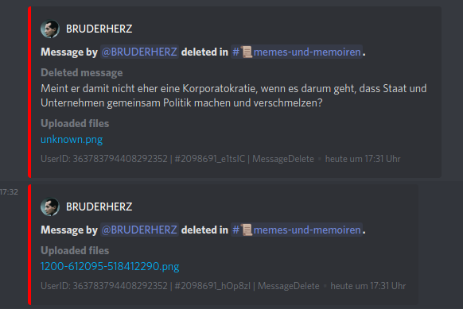
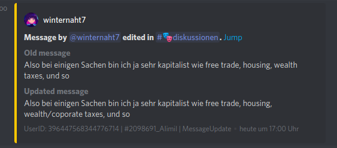
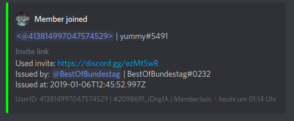

# DiscordMogLogger

This is a simple but scaleable discord bot that helps moderators of a guild by logging all relevant events.

## Features

- Message caching and logging
- Telling used invite on member join (useful for raids)
- Additional logging to webhook
- Channel filter
- Logging of all uploaded files and images

## Install

```bash
git clone git@github.com:zaanposni/DiscordModLogger.git discordmodlogger
cd discordmodlogger

docker build -t discordmoglogger .
docker run discordmodlogger
```

Before running, you want to create a config.json in the root directory and fill in your info (see default-config.json for reference)

## Contribute

Contributions are welcome.
If you are new to open source, checkout [this tutorial](https://github.com/firstcontributions/first-contributions).

## Example


<br/>

<br/>


